## Math API Server

This time we're going to write an API server that solves math problems for us. Each route is a different formula to solve, and values will be passed as GET arguments.

Let's look at the area of a square route below. The route is listed as `/area/square` with one variable `s`. Calling `http://localhost:3001/area/square?s=10` should return JSON with the answer.  For that route the JSON returned would be.

```json
{
    "a": 100,
    "s": 10
}
```

_Note that they keys in the JSON are lower case._

Each route must return any variables passed and the solution. Use the letters in the formulas listed as keys.

Routes must also return their data with the `application/json` content type and a `200` status code header, assuming it was a good request. 

There are two "bad requests" that you also need to account for.

* Incorrect route. This needs to return a 404 status header. 
* Invalid or missing GET variables. This should return a 400 status header. This would be cases like `/area/square?x=10` where the variable is `x` instead of `s` or just calling `/area/square` without any variables. 


Your code needs to start in the `mathapi.py` file, but you can add additional files if you would like. Running `python mathapi.py` should start your server.

The server needs to be attached to `127.0.0.1` on port `3001`

### Area Routes

#### Square

`/area/square`

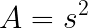


| Variable | Description |
| -------- | ----------- |
| s        | Side length |


#### Rectangle

`/area/rectangle` 

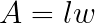


| Variable           | Description         |
| ------------------ | ------------------- |
| l (lower case ell) | Length of rectangle |
| w                  | Width of rectangle  |


#### Triangle

`/area/triangle`

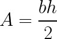


| Variable | Description        |
| -------- | ------------------ |
| b        | Base of Triangle   |
| h        | Height of triangle |


#### Triangle - Heron's Formula

`/area/heron`

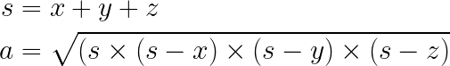


| Variable | Description   |
| -------- | ------------- |
| a        | Side length a |
| b        | Side length b |
| c        | Side length c |

On this one, `s` should be included in the returned JSON.


#### Parallelogram

`/area/parallelogram`

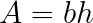

| Variables | Description    |
| --------- | -------------- |
| b         | Base dimension |
| h | Height of parallelogram |


#### Circle

`/area/circle`

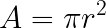

Use `math.pi` instead of 3.14

| Variable | Notes                |
| -------- | -------------------- |
| r        | Radius of the circle |


#### Trapezoid

`/area/trapezoid`

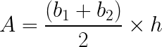


| Variables | Notes                   |
| --------- | ----------------------- |
| b1        | Length of one base      |
| b2        | Length of other base    |
| h         | Height of the trapezoid |


### Surface Area Routes

#### Cube

`/surface/cube`

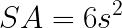

| Variable | Notes                   |
| -------- | ----------------------- |
| s        | Side length of the cube |


#### Sphere

`/surface/sphere`

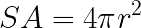

Use `math.pi` instead of 3.14

| Variable | Notes            |
| -------- | ---------------- |
| r        | Radius of sphere |


#### Cylinder

`/surface/cylinder`

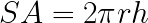

| Variables | Notes                  |
| --------- | ---------------------- |
| r         | Radius of the cylinder |
| h         | Height of the cylinder |


### Perimeter Routes 

#### Square

`/perimeter/square`

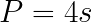

| Variable | Notes                     |
| -------- | ------------------------- |
| s        | Side length of the square |


#### Rectangle

`/perimeter/rectangle`

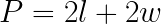

| Variables          | Notes                   |
| ------------------ | ----------------------- |
| l (lower case ell) | Length of the rectangle |
| w                  | Width of the rectangle  |


#### Triangle

`/perimeter/triangle`

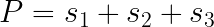

| Variable | Notes                   |
| -------- | ----------------------- |
| s1       | Side length of triangle |
| s2       | Side length of triangle |
| s3       | Side length of triangle |


#### Circle (Circumference)

`/perimeter/circle`

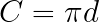

| Variable | Notes           |
| -------- | --------------- |
| d        | Circle diameter |


### Volume Routes

#### Cube

`/volume/cube`

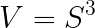

| Variable | Notes       |
| -------- | ----------- |
| s        | side length |


#### Rectangular Prism

`/volume/prism`

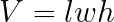

| Variable | Notes  |
| -------- | ------ |
| l        | Length |
| w        | Width  |
| h        | Height |


#### Square Pyramid

`/volume/pyramid`

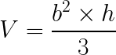

| Variable | Notes  |
| -------- | ------ |
| b        | Base   |
| h        | Height |


#### Cylinder

`/volume/cylinder`

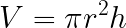

| Variable | Notes              |
| -------- | ------------------ |
| r        | Radius of circle   |
| h        | Height of cylinder |


#### Cone

`/volume/cone`

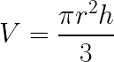

| Variable | Notes              |
| -------- | ------------------ |
| r        | Radius of circle   |
| h        | Height of cylinder |

#### Sphere

`/volume/sphere`

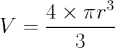

| Variable | Notes            |
| -------- | ---------------- |
| r        | Radius of sphere |


### Misc Routes

#### Distance Formula

`/distance`

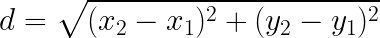

| Variable | Notes                    |
| -------- | ------------------------ |
| x1, y1   | Position of first point  |
| x2, y2   | Position of second point |


#### Slope

`/slope`

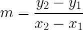

| Variable | Notes                    |
| -------- | ------------------------ |
| x1, y1   | Position of first point  |
| x2, y2   | Position of second point |

#### Pythagorean Theorem

`/pythag`

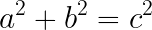

Use to solve for the third side in a right triangle. 

This one is going to be a little different than most of the other routes. You'll only send 2 of the 3 variables and your implementation should solve for the third. 

The JSON returned will contain all 3 values.

Calls to `/pythag?a=3&b=4`, `/pythag?b=4&c=5` & `/pythag?a=3&c=5` should all return the same JSON below. 

```json
{
    "a": 3,
    "b": 4,
    "c": 5
}
```


#### Mean

`/mean`

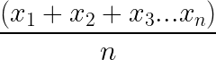

Solve for the average of all numbers passed as a comma separated list. 

| Variable | Description                                                  |
| -------- | ------------------------------------------------------------ |
| nums     | A comma separated list of integers to average. For example, if you want to average the numbers 1, 2, & 3 the route would look like `/mean?nums=1,2,3` |

In the JSON returned, the values should be returned as an array. For example, `/mean?nums=1,2,3` should return the following JSON.

```json
{
    "mean": 2,
    "nums": [
        1,
        2,
        3
    ]
}
```


#### Median

`/median`

Find the median value, the value in the middle, of a comma separated list of integers.  If there are an odd number of values, it is the middle value. If there are an even number of values, it is the average of the middle two. 

| Variable | Description                      |
| -------- | -------------------------------- |
| nums     | Comma separate list of integers. |

Like the mean route, `nums` should be included in the returned JSON as an array. 


#### Mode

`/mode`

Find the mode - the most common - of a list of comma separated values. 

| Variable | Description                      |
| -------- | -------------------------------- |
| nums     | Comma separate list of integers. |

Like the mean route, `nums` should be included in the returned JSON as an array. 